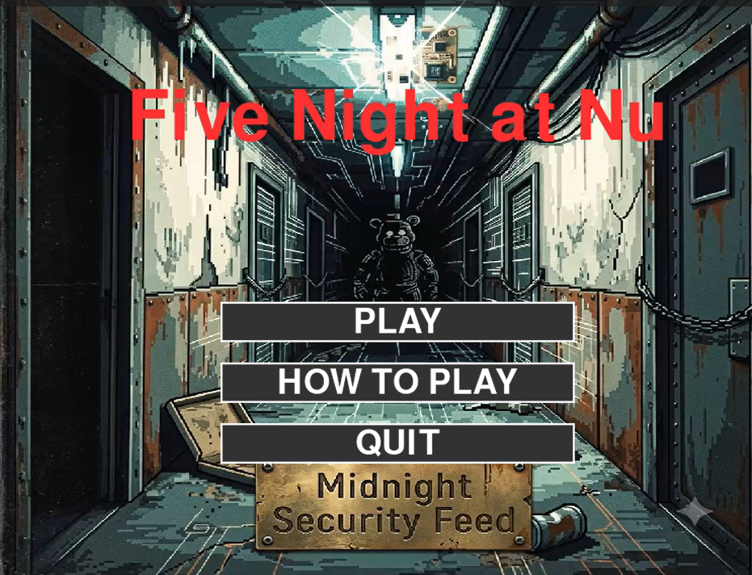

# Five Nights at Nagoya University

## 概要
名大キャンパスを舞台に、迫りくる敵から朝の6時まで生き延びる FNaF（Five Nights at Freddy's）風ホラーゲームです。プレイヤーは警備員として、限られた電力をやりくりしながら、監視カメラやセキュリティドアを駆使して敵の侵入を防ぎます。

## 実行方法
### 動作環境
- Python 3.9 以上推奨
- OS: Windows / macOS

### セットアップ
1. 必要なライブラリをインストールします。
   ```bash
   pip install -r requirements.txt
   ```
   ※主に `pygame`, `opencv-python`, `scikit-learn`, `numpy`, `joblib` を使用しています。

2. ゲームを起動します。
   ```bash
   python main.py
   ```

## 機械学習の要素について
本作では、敵の行動パターンを単なるランダムではなく、**2つの機械学習モデル（RandomForest分類器）** を用いて制御しています。これにより、予測困難で適応的な恐怖体験を実現しました。

### 1. 経路決定AI (基本行動の決定)
各Nightの難易度設定に基づき、敵が次に「どう動くか」を判断するベースAIです。
- **データ**: 敵とプレイヤーの状況（電力残量、左ドア状態、右ドア状態、現在位置ID、現在のカメラID の **5特徴量**）。各Nightごとに約6000サンプルのシミュレーションデータを生成して学習。
- **モデル**: `scikit-learn` の `RandomForestClassifier` (Night1〜5で異なるモデルを使用)
- **用途**: 敵の基本アクション（0:待機, 1:後退, 2:前進, 3:別ルートへ前進）を予測。Nightが進むにつれてアグレッシブに前進しやすいモデルになります。

### 2. プレイヤー行動予測型AI (難易度の動的適応)
プレイヤーの操作の「クセ」や「隙」をリアルタイムで学習し、弱点を突いてくる適応型AIです。
- **データ**: 直近30秒間のプレイヤーの行動履歴（左ドア閉鎖率、右ドア閉鎖率、カメラ使用率、左ライト使用率、右ライト使用率、電力、ゲーム内時刻 の **7特徴量**）。
- **モデル**: `scikit-learn` の `RandomForestClassifier`
- **用途**: プレイヤーの防御の偏りを分析し、「左から攻める(ATTACK_LEFT)」「右から攻める(ATTACK_RIGHT)」「猛攻を仕掛ける(AGGRESSIVE)」「様子を見る(CAUTIOUS)」の4つの攻撃戦略を5秒ごとに予測します。この戦略によって、経路決定AIが出した答えにバイアスをかけ、プレイヤーが手薄にしているルートに敵を誘導します。
- **体験**: 「右のドアばかり閉めていると、敵が左のルートから集中して攻めてくる」といった、プレイヤーの行動に対する適応を見せます。

## 操作方法
- **[A]**: 左ドアの開閉
- **[D]**: 右ドアの開閉
- **[Q]**: 左ライトのON/OFF（廊下の確認）
- **[E]**: 右ライトのON/OFF（廊下の確認）
- **[SPACE]**: 監視カメラモニターの開閉
- **マウス**: 
  - カメラモニター展開時: カメラボタン（CAM 0〜6）をクリックして視点切り替え
  - カメラモニター収納時: ドア付近のライトボタンをクリックしてON/OFF

※ ドアを閉じている間、ライトを点灯している間、モニターを開いている間は電力を消費します。電力が 0% になるとすべての設備がダウンし、無防備になります。

## プロジェクト構造
```text
FNaFproject/
│
├── main.py                  # ゲームのエントリーポイント
├── requirements.txt         # 依存ライブラリ一覧
├── config/                  
│   └── stages.json          # 各Nightの設定やAIモデルパス
├── src/                     # ソースコード
│   ├── ai/                  # AI関連クラス (AIController, AdaptiveAI, PlayerTracker)
│   ├── core/                # コアシステム (SceneManager等)
│   ├── entities/            # ゲームオブジェクト (Player, Enemy等)
│   └── scenes/              # 各画面の処理 (Game, GameOver, Title等)
├── ai_training/             # 機械学習モデルの学習用スクリプト
├── models/                  # 学習済みのモデルファイル (.pkl, .keras)
├── data/                    # プレイヤーの行動ログ保存先
└── assets/                  # 画像、音声、動画素材
```